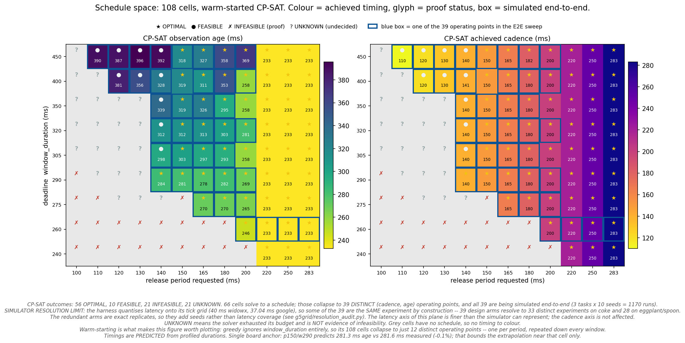

# Schmoo of the Octo schedule space (warm-started CP-SAT)

Reproduces `fig_schmoo.png`: 12 release periods x 9 deadline windows = 108 cells,
coloured by the timing CP-SAT achieves, glyphed by what it proves, and boxed where the
cell is being simulated end-to-end.



## Result

| | |
|---|---|
| cells | 108 (periods 100-283 ms x windows 240-450 ms) |
| solved to a schedule | **66** (56 OPTIMAL + 10 FEASIBLE) |
| proven impossible | 21 INFEASIBLE |
| undecided at budget | 21 UNKNOWN — *not* a negative result |
| distinct (cadence, age) operating points | **39** |

Warm-starting is the reason this figure has 2-D structure at all. `greedy` ignores
`window_duration` entirely, so its 108 cells collapse to **12** distinct operating points
— one per period, repeated down every window, giving a plot uniform along the deadline
axis. CP-SAT does respond to the deadline, so its own emitted schedule is what is shown.

## Reproducing

### 1. Solve the grid (needs a scheduling host; ~108 cells x up to 120 s at 8-way)

```bash
export XPURT_CPSAT_WORKERS=12          # see xpu-rt/cpsat_scheduler.py:_default_workers
./heatmap_warm.sh                      # writes gridw/<tag>.log + schedules/<tag>.json
```

`heatmap_warm.sh` derives one workload per cell from
`data/toplevel/networks_octo_pipe3fast10_qrb5165.json` by overriding `period` and
`window_duration`, then runs

```
scripts/run_xpurt_schedule.py --solver cpsat --seed-solver heft_edf \
    --cpsat-time-limit 120 --profiled
```

`--seed-solver heft_edf` is the warm start. Only CP-SAT treats `window_duration` as a
hard constraint — greedy ignores it, and heft/heft_edf/greedy_reserved count violations
and emit the schedule anyway — so CP-SAT is the only solver whose status means anything
here.

### 2. Collect

```bash
python extract_gw.py > gw.json         # reads schedules/*_GW_p*_w*_cpsat_profiled.json
```

Per cell it recovers `lat_med`/`lat_max` as the per-instance SPAN (max end − min start
over that instance's dispatches), `cadence` as the median gap between instance starts,
and the makespan. `gridw.log` carries the per-cell status line.

`grid_warm.json` (108 cells + a `source` provenance block) and `grid_warm_status.txt`
(108 lines, `p=P w=W -> STATUS`) are the collected outputs, committed here so the figure
reproduces without re-solving.

### 3. Plot

```bash
python fig_schmoo.py                   # -> fig_schmoo.png
python resolution_audit.py             # -> resolution_audit.json
```

`fig_schmoo.py` reads `grid_warm.json` and `arms.tsv` only. `arms.tsv` is the 39 distinct
operating points (`name  age_ms  cadence_ms  latency_ms`) and drives the blue boxes.

## Two correctness properties the scripts assert

**Monotonicity in the window.** A larger window is a strictly looser deadline, so a cell
solvable at a tighter window cannot be infeasible at a looser one. `fig_schmoo.py`
asserts this and refuses to plot a grid that violates it. The earlier COLD grid failed
this at all 6 of its INFEASIBLE cells (e.g. `p=180 w=350` OPTIMAL but `p=180 w=400`
INFEASIBLE) — those labels were artifacts, not proofs. This warm grid has zero
violations, and its INFEASIBLE cells sit only at the tightest windows (240-290).

**Simulator resolution.** `resolution_audit.py` shows the 39 operating points are not 39
experiments. The evaluation harness quantises latency onto its tick grid — 40 ms on
widowx, 37.04 ms on google_robot — and builds the schedule as integer tick indices, so
arms whose (freshest-inference, observation-snap-tick) sequences coincide are the same
experiment by construction:

```
coke  (google_robot):  39 design arms -> 33 distinct experiments
egg   (widowx):        39            -> 28
spoon (widowx):        39            -> 28
```

The widowx collapse is *worse* despite its finer actuation, because its 40 ms tick is
coarser than google's 37.04 ms. Redundant arms are exact replicates: they add seeds, not
latency coverage. Do not report a ladder as spanning more latency resolution than the
tick grid can represent.

## Caveat on the timings

All latency/cadence values here are **PREDICTED** from the profiled per-op durations, not
measured on the QRB5165. One board anchor exists: cell p150/w290 predicts 281.3 ms
observation age against 281.6 ms measured (−0.1%), and 150.0 ms cadence against 146.5 ms
measured (+2.4%, prediction pessimistic). Board error is not one-directional, so that
bounds the extrapolation near that cell only.

CP-SAT with more than one search worker is not bit-reproducible — the result depends on
thread interleaving. Any schedule it returns is valid and is verified against the
deadline separately, but re-running the grid may move individual UNKNOWN cells.

## Files

| file | what |
|---|---|
| `heatmap_warm.sh` | solves the 108-cell grid, warm-started CP-SAT |
| `extract_gw.py` | collects per-cell latency/cadence from the emitted schedules |
| `gridw.log` | raw per-cell status, 108 lines |
| `grid_warm.json` | collected grid + provenance block |
| `grid_warm_status.txt` | 108 lines, `p=P w=W -> STATUS` |
| `arms.tsv` | the 39 distinct operating points |
| `fig_schmoo.py` | the figure |
| `resolution_audit.py` | structural distinct-experiment audit |
